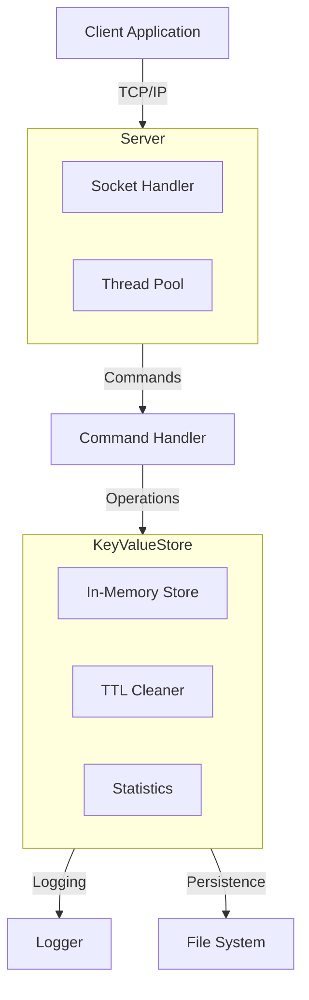
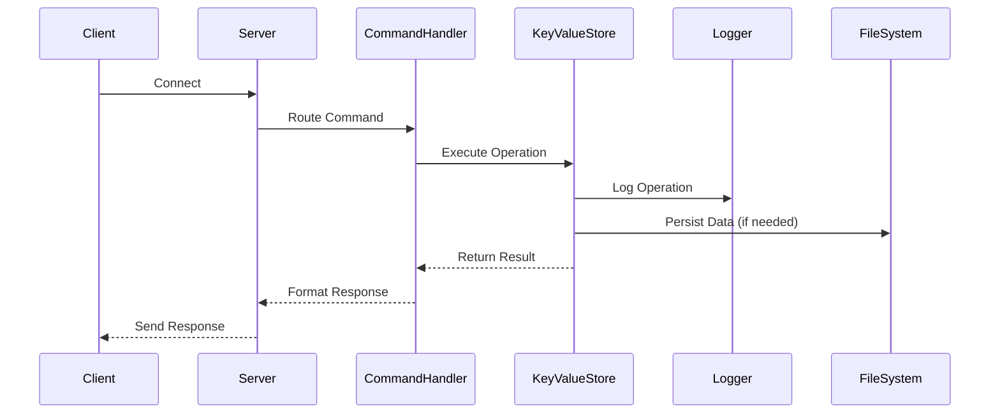

# Key-Value Store System Architecture

## System Overview

## Component Details

### Client
- TCP/IP client application
- Handles user input and server communication
- Supports interactive command-line interface

### Server
- Manages TCP/IP connections
- Handles multiple client connections concurrently
- Routes client requests to CommandHandler

### CommandHandler
- Processes client commands
- Validates input
- Converts commands to KeyValueStore operations
- Formats responses

### KeyValueStore
- Core data structure implementation
- Manages key-value pairs with TTL support
- Handles data persistence
- Maintains statistics
- Runs background TTL cleaner

### Logger
- Handles system logging
- Supports both console and file output
- Thread-safe logging operations

## Data Flow

## Key Features

1. **Concurrency**
   - Thread-safe operations
   - Concurrent client handling
   - Background TTL cleanup

2. **Persistence**
   - File-based data storage
   - Save/Load operations
   - Automatic data recovery

3. **Monitoring**
   - Real-time statistics
   - Operation logging
   - Performance metrics

4. **Security**
   - Input validation
   - Error handling
   - Safe file operations 